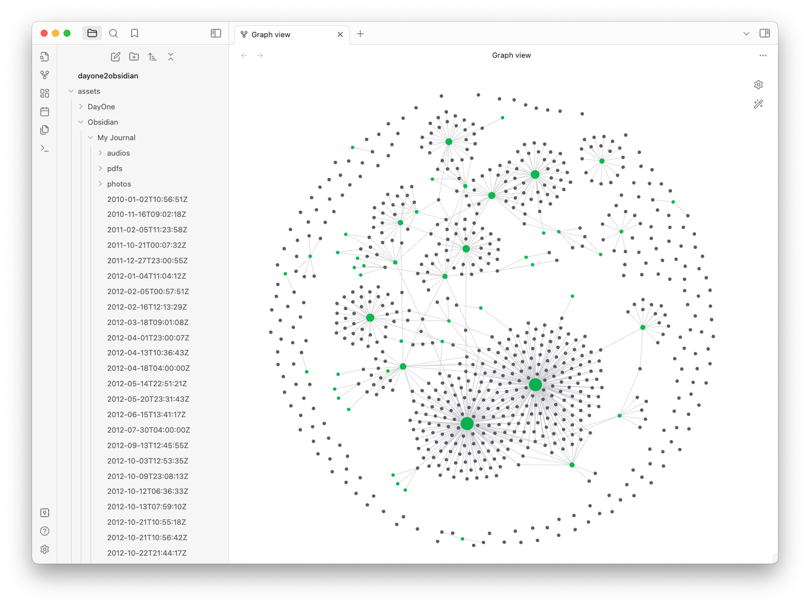

# Day One 2 Obsidian

Convert your [Day One](https://dayoneapp.com) journal to an [Obsidian](https://obsidian.md) vault folder.

(1) Create empty `assets/DayOne` and `assets/Obsidian` folders.

(2) Extract your Day One JSON (.zip) export file into the `assets/DayOne` folder.

(3) Change these:

```javascript
// Input Day One JSON (.zip) extract folder - SET THIS!
const dayOneFolder = './assets/DayOne/yyyy-M-dd-Journal/';

// Input Day One JSON (.zip) Journal Name - SET THIS!
const dayOneName = 'Journal';
```

(4) Run this:

```console
% node dayone2obsidian
```

(5) Get this in an Obsidian vault created in your `dayone2obsidian` folder.


